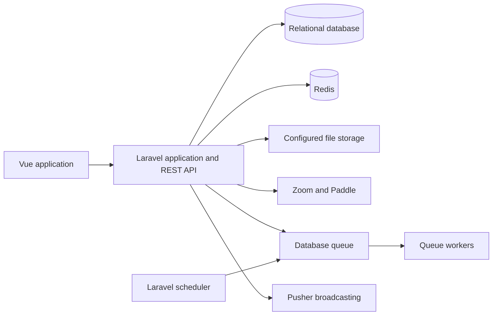

<p align="center">
  
</p>

<h1 align="center">DayWright</h1>

<p align="center">Open-source project management and collaboration for teams.</p>

<p align="center">
  <a href="https://github.com/hamza094/daywright/actions/workflows/tests.yml"></a>
  <a href="LICENSE"></a>
  <a href="https://sonarcloud.io/summary/new_code?id=hamza094_ProFresh"></a>
</p>

DayWright brings project planning and team communication into one workspace. Create projects, organize work into stages, assign and track tasks, and keep discussions and activity connected to the work they belong to.

There is no hosted demo currently linked from this repository. Developers can run the application locally and explore its generated API documentation.

## What you can do

- **Plan work:** organize projects into stages, create tasks, assign members, track status and due dates, and review project activity.
- **Work with a team:** invite project members, manage access, exchange project messages, and use conversations for group discussions.
- **Keep work visible:** use dashboards, project insights, notifications, and activity history to follow progress.
- **Meet and share:** schedule Zoom meetings, upload files, and use email and SMS notifications where configured.
- **Manage accounts:** sign in with supported social providers, enable two-factor authentication, manage API tokens, and handle subscriptions through Paddle.

## Documentation

- [API reference (OpenAPI JSON)](api.json) — generated with Laravel Scramble. In a running local app, the interactive docs are available at `/docs/api`.
- [Deployment guide](docs/DEPLOYMENT.md)
- [Feature flags](docs/FEATURE_FLAGS.md)
- [Webhook inbox and recovery](docs/WEBHOOK_INBOX.md)
- [Adding webhook providers](docs/WEBHOOK_PROVIDER_ONBOARDING.md)
- [Contributing](CONTRIBUTING.md)
- [Security policy](SECURITY.md)

## Application architecture

The browser client is a Vue 2 single-page application built and served by Laravel. Laravel exposes a versioned REST API under `/api/v1`, persists application data in a relational database, and uses queues and the scheduler for work that should run outside a web request. Redis is used by the documented production setup for cache, rate limits, and distributed scheduler/queue locks. Pusher provides broadcasting when configured.



The production deployment guide currently documents MySQL or PostgreSQL, Redis, database-backed queue workers, and the Laravel scheduler. CI exercises both SQLite and MySQL 8.4. Configure storage and external services for the environment where you deploy.

## Reliability and security

- Zoom webhook requests are signature-verified before acceptance. Accepted events enter a durable inbox so duplicate delivery, retries, and recovery can be handled without treating every delivery as a new event.
- Scheduled recovery jobs handle pending webhook work, ambiguous Zoom meeting operations, and subscription operations. Queue workers are separated by priority and workload.
- Task and project edits use version checks to detect stale concurrent updates.
- The API uses Sanctum authentication, scoped personal access tokens, authorization middleware, and route-specific rate limits. Authentication, token management, two-factor flows, and destructive account actions have dedicated tests.
- Sensitive values are scrubbed from application logs. Paddle and Zoom integrations use validated webhook flows; external credentials are supplied through environment configuration.

These mechanisms depend on correct production configuration. See the [deployment guide](docs/DEPLOYMENT.md) for worker, scheduler, Redis, and operational details.

## Technology

- **Backend:** PHP 8.3+, Laravel 12, Laravel Sanctum, Laravel Scramble
- **Frontend:** Vue 2, Vite, Laravel Echo
- **Data and jobs:** MySQL or PostgreSQL for deployment; SQLite and MySQL in CI; Redis and Laravel queues
- **Integrations:** Zoom Meetings, Paddle, Pusher, Vonage SMS, and S3-compatible storage (when configured)
- **Quality:** PHPUnit, Larastan/PHPStan, Laravel Pint, Rector, ESLint, Stylelint, and GitHub Actions

## Run locally

Requirements: PHP 8.3+, Composer, Node.js 20, npm, and a supported database. Redis and third-party credentials are needed to exercise the related integrations and production queue setup.

```bash
git clone https://github.com/hamza094/daywright.git
cd daywright
composer install
npm ci
```

Create `.env` from `.env.example`, then set `APP_URL`, database credentials, and any integration credentials you need. Generate the application key, prepare the database, and start the app and frontend build:

```bash
cp .env.example .env
php artisan key:generate
php artisan migrate
npm run dev:all
```

`npm run dev:all` starts Laravel's development server and Vite. If you configure a database queue instead of the local synchronous queue, run a worker in another terminal with `php artisan queue:work`. The full worker and scheduler setup is in [docs/DEPLOYMENT.md](docs/DEPLOYMENT.md).

## Tests and code quality

Run the backend test and quality checks with:

```bash
composer test
composer stan
composer pint:test
composer rector:test
```

Frontend checks used in CI:

```bash
npx eslint "resources/**/*.{vue,js}" --max-warnings=0
npm run stylelint
npm test
npm run build
```

GitHub Actions runs PHPUnit against SQLite and MySQL 8.4, PHPStan/Larastan, Pint, Rector, frontend linting and tests, and dependency audits. The npm audit step currently allows known findings to pass (`|| true`); it is not a clean-audit guarantee.

## Deployment

Production operation requires environment-specific database, cache, storage, and integration configuration. For asynchronous delivery and scheduled recovery, configure Redis, database queue workers, and the Laravel scheduler. The detailed requirements, worker commands, Supervisor examples, and recovery procedures are in the [deployment guide](docs/DEPLOYMENT.md).

## Contribute

Bug reports, focused fixes, and tests are welcome. Start with [CONTRIBUTING.md](CONTRIBUTING.md), review the [Code of Conduct](CODE_OF_CONDUCT.md), and use the [issue tracker](https://github.com/hamza094/daywright/issues) to discuss proposed changes.

## License

DayWright is licensed under the [GNU Affero General Public License v3.0](LICENSE).
