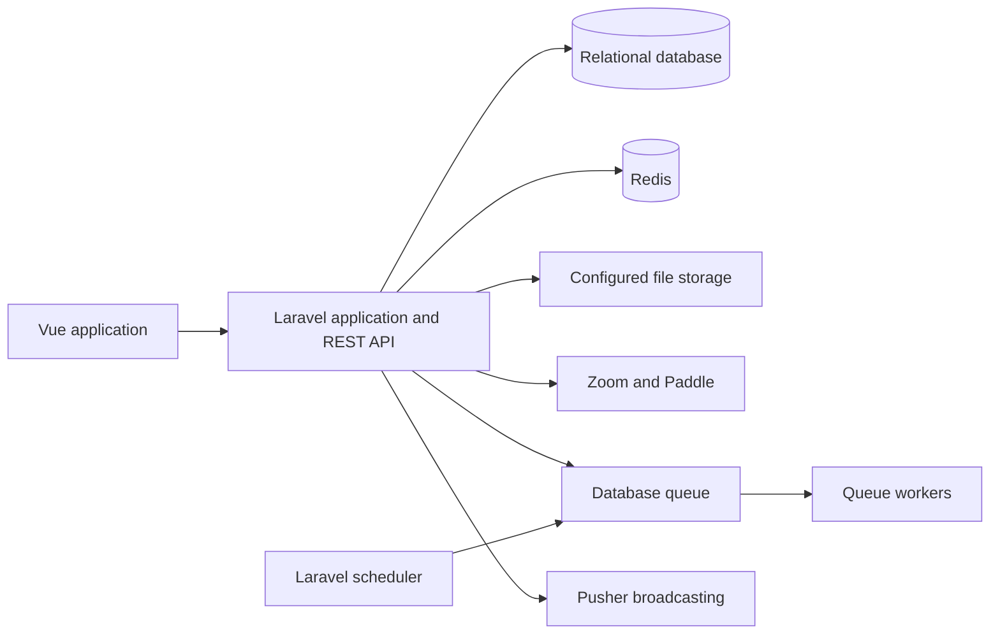

<p align="center">
  
</p>

<h1 align="center">DayWright</h1>

<p align="center">Open-source project management and collaboration for teams.</p>

<p align="center">
  <a href="https://github.com/hamza094/daywright/actions/workflows/tests.yml"></a>
  <a href="LICENSE"></a>
  <a href="https://sonarcloud.io/summary/new_code?id=hamza094_ProFresh"></a>
</p>

DayWright brings project planning and team communication into one workspace. Create projects, organize work into stages, assign and track tasks, and keep discussions and activity connected to the work they belong to.

There is no hosted demo currently linked from this repository. Developers can run the application locally and explore its generated API documentation.

## What you can do

- **Plan work:** organize projects into stages, create tasks, assign members, track status and due dates, and review project activity.
- **Work with a team:** invite project members, manage access, exchange project messages, and use conversations for group discussions.
- **Keep work visible:** use dashboards, project insights, notifications, and activity history to follow progress.
- **Meet and share:** schedule Zoom meetings, upload files, and use email and SMS notifications where configured.
- **Manage accounts:** sign in with supported social providers, enable two-factor authentication, manage API tokens, and handle subscriptions through Paddle.

## Documentation

- [Product overview](https://profresh.gitbook.io/profresh-docs)
- [Local development](https://profresh.gitbook.io/profresh-docs/developers/setup-local-development)
- [Contributing](CONTRIBUTING.md)
- [API reference](api.json)
- [Deployment guide](docs/DEPLOYMENT.md)

## Application architecture

The browser client is a Vue 2 single-page application served by Laravel. Laravel provides the versioned REST API under `/api/v1`, stores application data in a relational database, and uses queues and the scheduler for background work. Production uses a database queue; Redis supports cache, rate limits, and scheduler/queue locks. Pusher broadcasting is available when configured.



The deployment guide covers MySQL or PostgreSQL, Redis, queue workers, and the scheduler. CI tests SQLite and MySQL 8.4.

## Reliability and security

- Zoom webhook requests are signature-verified before acceptance. Accepted events enter a durable inbox so duplicate delivery, retries, and recovery can be handled without treating every delivery as a new event.
- Scheduled recovery jobs handle pending webhook work, ambiguous Zoom meeting operations, and subscription operations. Queue workers are separated by priority and workload.
- Task and project edits use version checks to detect stale concurrent updates.
- For task and project updates, clients should read the resource's `version`, send it with the PATCH request, store the returned version, and reload/reconcile before retrying after a `409 edit_conflict` response. This is internal concurrency metadata; it is not the `/api/v1` API version.
- The API uses Sanctum authentication, scoped personal access tokens, authorization middleware, and route-specific rate limits.
- Sensitive values are scrubbed from application logs. Paddle and Zoom integrations use validated webhook flows; external credentials are supplied through environment configuration.

These mechanisms depend on correct production configuration. See the [deployment guide](docs/DEPLOYMENT.md) for worker, scheduler, Redis, and operational details.

## Technology

- **Backend:** PHP 8.3+, Laravel 12, Laravel Sanctum, Laravel Scramble
- **Frontend:** Vue 2, Vite, Laravel Echo
- **Data and jobs:** MySQL or PostgreSQL for deployment; SQLite and MySQL in CI; Redis and Laravel queues
- **Integrations:** Zoom Meetings, Paddle, Pusher, Vonage SMS, and S3-compatible storage (when configured)
- **Quality:** PHPUnit, Larastan/PHPStan, Laravel Pint, Rector, ESLint, Stylelint, and GitHub Actions

## Run locally

Requirements: PHP 8.3+, Composer, Node.js 20, npm, MySQL, and Redis. The example environment uses MySQL and Redis; configure their local connection values before setup. Third-party credentials are only needed to try those integrations.

```bash
git clone https://github.com/hamza094/daywright.git
cd daywright
composer install
npm ci
```

Create `.env` from `.env.example`, then set `APP_URL` and local database and Redis credentials. The example uses the synchronous queue locally, so a queue worker is not needed for the quick start. Generate the application key, migrate the database, and start Laravel and Vite:

```bash
cp .env.example .env
php artisan key:generate
php artisan migrate
npm run dev:all
```

`npm run dev:all` starts Laravel's development server and Vite. If you switch to a database queue, run a worker in another terminal with `php artisan queue:work`. Production worker and scheduler instructions are in [docs/DEPLOYMENT.md](docs/DEPLOYMENT.md).

## Tests and code quality

Run the backend test and quality checks with:

```bash
composer test
composer stan
composer pint:test
composer rector:test
```

Frontend checks used in CI:

```bash
npx eslint "resources/**/*.{vue,js}" --max-warnings=0
npm run stylelint
npm test
npm run build
```

GitHub Actions runs PHPUnit against SQLite and MySQL 8.4, PHPStan/Larastan, Pint, Rector, frontend linting and tests, and dependency audits. The npm audit step currently allows known findings to pass (`|| true`); it is not a clean-audit guarantee.

## Deployment

For production requirements and the worker and scheduler setup, see the [deployment guide](docs/DEPLOYMENT.md).

## Contribute

Bug reports, fixes, and tests are welcome. Follow the [GitHub contribution guide](CONTRIBUTING.md) and [Code of Conduct](CODE_OF_CONDUCT.md), or use the [issue tracker](https://github.com/hamza094/daywright/issues) to discuss a change.

## License

DayWright is licensed under the [GNU Affero General Public License v3.0](LICENSE).
