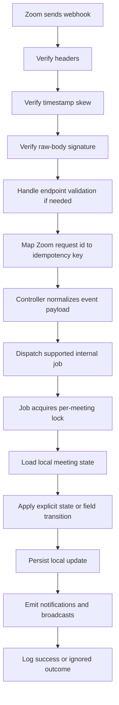

# Zoom Webhook Production-Safe Design

Created: 2026-06-01

This document defines the target production-safe design for Zoom webhook handling in DayWright.
The goal is to make webhook delivery trustworthy, idempotent, observable, and resilient to real provider behavior such as retries, delivery disorder, stale events, and partial payload drift.

This is a design document, not just a checklist.
It describes the target architecture, the expected control flow, the event handling contract, and the phased rollout path.

## Goal

- Accept only authentic Zoom webhook requests.
- Process supported Zoom meeting events safely even when deliveries are duplicated, delayed, or out of order.
- Normalize provider payloads into internal commands before local writes happen.
- Make webhook side effects deterministic so local meeting state, notifications, and broadcasts stay correct.
- Give operators enough visibility to diagnose failures and replay or ignore events intentionally.

## Non-Goals

- Supporting every Zoom webhook event family.
- Replacing the current meeting domain model.
- Turning the webhook controller into a business-logic controller.
- Storing the full provider payload in application tables for primary business logic.
- Introducing a generic event bus redesign outside the Zoom webhook surface.

## Production-Safe Requirements

- Signature verification uses the exact raw request body received from Zoom.
- Required provider headers are validated before the request reaches webhook business logic.
- Duplicate deliveries are safe at both the HTTP boundary and the queue-processing boundary.
- Unsupported provider fields do not flow directly into Eloquent writes.
- Missing local meetings from stale or late events do not create noisy failed jobs.
- State transitions are explicit, narrow, and idempotent.
- Notifications and broadcasts are emitted only after a valid local state transition.
- Webhook failures are observable with enough context to debug them quickly.

## Current Risk Summary

- Signature verification currently rebuilds JSON from parsed request input instead of hashing the raw request body.
- Update events forward provider fields too loosely into application writes.
- Some event jobs assume optional payload fields are always present.
- Some missing-meeting scenarios are treated as failures even though they are expected in real webhook systems.
- Existing tests cover the route contract and happy paths, but they do not yet prove the full production-safe behavior model.

## Design Principles

### 1. Authenticate First

- Reject invalid requests at the HTTP edge.
- Do not parse the request into business commands until authenticity is proven.

### 2. Normalize Before Writing

- Provider payloads are external contracts, not internal persistence payloads.
- Map supported provider fields to explicit internal fields.
- Ignore unsupported provider keys unless the team intentionally expands the contract.

### 3. Assume Delivery Disorder

- Zoom may retry, reorder, or redeliver the same event.
- Missing local state is not automatically an error.
- Duplicate state transitions should be treated as no-ops.

### 4. Separate Transport From Domain

- Middleware verifies authenticity.
- Controllers only acknowledge, normalize, and dispatch.
- Jobs or actions own domain transitions.
- Notifications and broadcasts happen only after valid writes.

### 5. Prefer Deterministic Recovery

- Failures should be explainable by logs and queue state.
- Operators should be able to distinguish invalid requests, ignored stale events, retryable failures, and terminal failures.

## Supported Event Scope

This design assumes the current supported Zoom meeting event scope remains intentionally small:

- `meeting.updated`
- `meeting.deleted`
- `meeting.started`
- `meeting.ended`

Any additional Zoom webhook event should be treated as unsupported until it is explicitly modeled, normalized, tested, and documented.

## Target Request Lifecycle



## HTTP Boundary Design

### Route Layer

- Keep the Zoom webhook routes grouped under the current provider-specific prefix.
- Keep provider traffic outside normal user-authenticated route flows.
- Keep HTTP-level idempotency on the route group because provider retries are external and stateless.

### Middleware Responsibilities

`VerifyZoomWebhook` should own only provider authenticity and transport normalization:

- Require `x-zm-request-id`.
- Require `x-zm-signature`.
- Require `x-zm-request-timestamp`.
- Reject timestamps outside the accepted skew window.
- Compute the expected signature from the raw request body exactly as received.
- Map the Zoom request id onto the app idempotency header after verification succeeds.
- Detect and respond to endpoint validation requests if Zoom requires them.

What middleware should not do:

- Apply business event routing.
- Update meetings directly.
- Decide notification behavior.
- Persist provider payloads.

## Controller Design

The webhook controller should remain intentionally thin.

Controller responsibilities:

- Validate top-level webhook shape.
- Identify the supported event type.
- Normalize the provider payload into a small internal command array or DTO.
- Dispatch the correct background job.
- Return an acknowledgment response immediately.

Controller non-responsibilities:

- Writing meetings directly.
- Inferring broad provider payload semantics.
- Sending notifications.
- Broadcasting meeting updates.
- Retrying provider-originated failures.

## Normalized Internal Event Contract

Each supported Zoom event should be converted into an explicit internal payload.

### Meeting Updated

Target payload:

```json
{
  "meeting_id": 813,
  "changes": {
    "topic": "Updated topic",
    "agenda": "Updated agenda",
    "start_time": "2026-06-01T10:00:00Z",
    "duration": 30,
    "timezone": "UTC",
    "password": "secret",
    "join_before_host": false
  }
}
```

Rules:

- Only include allowlisted local fields.
- Drop provider-only fields such as account, operator, UUID, or nested unsupported structures.
- Normalize timestamps before the job receives them.

### Meeting Deleted

Target payload:

```json
{
  "meeting_id": 813
}
```

Rules:

- Deletion is idempotent.
- Missing local meeting should be logged and ignored, not failed.

### Meeting Started

Target payload:

```json
{
  "meeting_id": 813,
  "start_time": "2026-06-01T10:00:00Z"
}
```

Rules:

- `start_time` may be nullable if Zoom omits it.
- Starting an already-started meeting should be a no-op.

### Meeting Ended

Target payload:

```json
{
  "meeting_id": 813,
  "start_time": "2026-06-01T10:00:00Z",
  "end_time": "2026-06-01T10:45:00Z"
}
```

Rules:

- `start_time` and `end_time` may be nullable if Zoom omits them.
- Ending an already-ended meeting should be a no-op.

## Job Design

Every supported webhook job should follow the same control pattern:

1. Acquire the shared per-meeting lock.
2. Load the local meeting by `meeting_id`.
3. If the meeting is missing and the event is stale or harmless, log and exit successfully.
4. Compare the requested transition or field changes against current local state.
5. If nothing needs to change, log an ignored or duplicate outcome and exit successfully.
6. Persist the update.
7. Emit side effects only after the local write succeeds.
8. Log a structured success result.

### Update Job Rules

- Apply only normalized allowlisted fields.
- Ignore unknown fields before `update()` is called.
- Avoid comparing unsupported provider keys against model attributes.
- Prefer a local helper or DTO that returns only changed, safe fields.

### Delete Job Rules

- Deleting a missing local meeting is a success-path no-op.
- Delete should not create retries for already-deleted meetings.

### Start Job Rules

- Missing local meeting should be ignored safely unless the team explicitly wants a retry policy.
- Status transition should be allowed only from non-started states.
- Notifications and broadcasts should happen only on the first valid transition to started.

### End Job Rules

- Missing local meeting should be ignored safely.
- Status transition should be allowed only from non-ended states.
- Notifications and broadcasts should happen only on the first valid transition to ended.

## State Transition Model

The webhook design should treat meeting state transitions as explicit domain rules.

Recommended model:

- `waiting` or scheduled local state -> `started`
- `started` -> `ended`
- `ended` + duplicate `meeting.ended` -> no-op
- `started` + duplicate `meeting.started` -> no-op
- `ended` + late `meeting.started` -> ignored and logged as stale

This rule set prevents duplicate notification and broadcast side effects while keeping late provider deliveries harmless.

## Notification And Broadcast Rules

- Notifications should be emitted only when a local state transition actually occurs.
- Broadcast events should reflect the post-write meeting state, not the provider payload alone.
- Duplicate or stale webhooks must not re-send notifications.
- A failed notification after a successful state write should be observable without reverting the meeting status.

## Logging And Observability Design

Every webhook path should log structured context.

Recommended log fields:

- `provider`: `zoom`
- `event`: `meeting.updated`, `meeting.deleted`, `meeting.started`, or `meeting.ended`
- `zoom_request_id`
- `meeting_id`
- `outcome`: `processed`, `ignored_duplicate`, `ignored_missing`, `ignored_stale`, `rejected_invalid`, or `failed`
- `job`
- `exception`
- `retry_count`

Recommended logging policy:

- Invalid signature or malformed request: `warning`
- Duplicate or stale supported event: `info`
- Retryable job failure: `error`
- Terminal job failure after retries: `critical` or `error` depending on existing logging conventions

## Optional Inbox Pattern

If the team wants stronger replay and audit capabilities later, introduce a webhook inbox table.

Suggested fields:

- provider
- zoom_request_id
- event_name
- received_at
- raw_payload
- normalized_payload
- processing_status
- attempt_count
- last_error

Benefits:

- Replayability
- Stronger audit trail
- Easier operator tooling
- Clear distinction between rejected, ignored, processed, and failed events

This inbox is optional for the first hardening pass, but it is the cleanest long-term design if webhook volume or provider complexity grows.

## Recommended Test Matrix

### Middleware Tests

- Valid signature passes with the raw request body.
- Invalid signature is rejected.
- Missing request id is rejected.
- Stale timestamp is rejected.
- Request id is forwarded into idempotency handling.
- Endpoint validation flow succeeds if supported.

### Controller Tests

- Supported events dispatch the correct normalized job payload.
- Unsupported or malformed payloads fail cleanly.
- Controller returns acknowledgment without performing direct writes.

### Job Tests

- Update job ignores unsupported provider keys.
- Update job persists only allowlisted changes.
- Delete job ignores missing local meetings.
- Start job handles missing optional timestamps safely.
- End job handles missing optional timestamps safely.
- Duplicate started or ended events do not re-send notifications.
- Late stale events do not break local state.

### End-To-End Webhook Tests

- Valid signed event updates the meeting locally.
- Duplicate delivery does not mutate state twice.
- Valid event for a missing meeting is treated as ignored, not failed.
- Notification and broadcast side effects happen only once for a real transition.

## Rollout Phases

### Phase 0 - Freeze The Current Webhook Surface

- Freeze the current supported Zoom meeting event list.
- Freeze the current acknowledgment response shape.
- Identify where provider payloads currently leak into writes.

### Phase 1 - Fix The HTTP Verification Boundary

- Move signature verification to the raw body.
- Keep header and timestamp validation.
- Add endpoint validation support if needed.

### Phase 2 - Introduce Payload Normalization

- Convert controller dispatch payloads from pass-through provider objects to normalized internal commands.
- Add allowlist mapping for update events.

### Phase 3 - Make Jobs Fully Idempotent

- Treat duplicate and missing-meeting scenarios as safe no-ops.
- Add explicit stale and duplicate transition handling.

### Phase 4 - Tighten Side Effects And Observability

- Guard notifications and broadcasts behind real state transitions.
- Standardize structured logging.

### Phase 5 - Optional Inbox And Replay Tooling

- Introduce a durable webhook inbox if the team wants replay and audit support.

## Release Gate

This design is considered implemented only when:

- Raw-body verification is live and tested.
- All supported events are normalized before persistence.
- Missing, duplicate, and stale deliveries are safe.
- Notifications and broadcasts are protected from duplicate delivery side effects.
- Targeted webhook middleware, controller, and job tests pass.

## Notes For Future Providers

- Webhooks should always be modeled as hostile transport inputs until verified.
- Provider payloads should never be treated as direct model update arrays.
- Duplicate delivery and stale delivery are standard behavior, not edge cases.
- The best webhook design separates authenticity, normalization, domain transition, and side effects into distinct layers.
