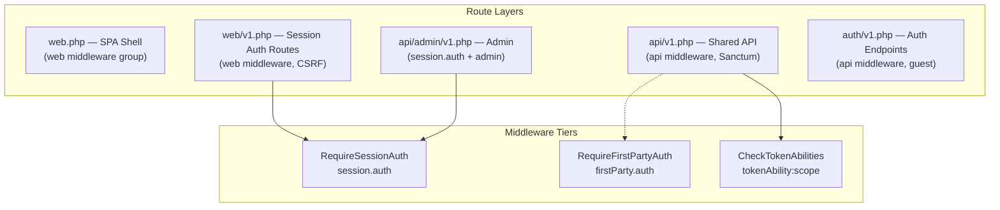

# 🔐 DayWright — Route Security Audit Report

**Auditor:** Senior Laravel Architect Review  
**Date:** 2026-08-13  
**Scope:** Route separation (SPA / API tokens / Admin), middleware stack, scope enforcement, production readiness

---

## Executive Summary

**Overall Production Readiness: ✅ READY — with 1 Critical and 4 Medium items to address**

The route security architecture is **well above average** for a Laravel application. The three-tier auth model (`session.auth` → `firstParty.auth` → `tokenAbility`) is thoughtfully designed and consistently applied. The anti-token-chaining strategy via `RequireSessionAuth` is a sophisticated security measure rarely seen in most projects. Rate limiting is layered and granular. The codebase demonstrates strong security awareness.

That said, the audit uncovered **1 critical CORS misconfiguration**, several **medium-priority hardening gaps**, and a few **low-priority improvements**.

---

## Architecture Overview



### Auth Strategy Matrix

| Route Group                       | Auth Method              | Token Chaining Blocked | Scope Enforced    | CSRF               |
| --------------------------------- | ------------------------ | ---------------------- | ----------------- | ------------------ |
| `web/v1.php` (Session, 2FA)       | `session.auth`           | ✅ Yes                 | N/A               | ✅ Yes (web group) |
| `api/v1/tokens.php`               | `session.auth`           | ✅ Yes                 | N/A               | ❌ No (api group)  |
| `api/v1/users.php` (password)     | `firstParty.auth`        | ✅ (partially)         | N/A               | ❌ No (api group)  |
| `api/v1/users.php` (subscription) | `session.auth`           | ✅ Yes                 | N/A               | ❌ No (api group)  |
| `api/admin/v1.php`                | `session.auth` + `admin` | ✅ Yes                 | N/A               | ❌ No (api group)  |
| All other api/v1 routes           | `auth:sanctum`           | ❌ No (by design)      | ✅ `tokenAbility` | ❌ No (api group)  |

---

## 🔴 Critical Issues

### CRIT-1: CORS Configuration Allows All Origins With Credentials

**File:** [cors.php](file:///c:/Users/Hamza/daywright/config/cors.php#L20-L34)

```php
'allowed_origins' => ['*'],
'allowed_origins_patterns' => ['*'],
'supports_credentials' => true,
```

> [!CAUTION]
> **This is a textbook CORS misconfiguration.** When `supports_credentials` is `true`, the browser sends cookies (including the session cookie) with cross-origin requests. Combined with `allowed_origins => ['*']`, **any malicious website can make authenticated requests on behalf of a logged-in user's session.**
>
> While modern browsers block `Access-Control-Allow-Origin: *` when credentials are included (the spec requires an explicit origin), the `allowed_origins_patterns => ['*']` wildcard pattern causes Fruitcake/Laravel CORS to **echo back the requesting origin** in the response header, effectively bypassing this browser protection.

**Impact:** Session hijacking from any origin. A CSRF-like attack that bypasses your CSRF token protection entirely because the attacker reads the response (which CSRF tokens don't protect against — they only prevent blind form submissions).

**Fix:**

```php
'allowed_origins' => explode(',', env('CORS_ALLOWED_ORIGINS', 'https://yourdomain.com')),
'allowed_origins_patterns' => [],
'supports_credentials' => true,
```

**Severity: 🔴 Critical — Must fix before production**

---

## 🟡 Medium Issues

### MED-1: `EnsureSessionAuthVersionIsCurrent` is a No-Op

**File:** [EnsureSessionAuthVersionIsCurrent.php](file:///c:/Users/Hamza/daywright/app/Http/Middleware/EnsureSessionAuthVersionIsCurrent.php#L18-L21)

```php
public function handle(Request $request, Closure $next)
{
    return $next($request); // Does nothing
}
```

This middleware exists but has no logic — it's a pass-through. It's registered nowhere in routes or Kernel.

**Risk:** If this was intended to invalidate stale sessions after password changes or 2FA toggles, that protection is missing. After a user changes their password, existing sessions on other devices remain valid indefinitely.

**Recommendation:**

- Either implement session versioning (store a version hash in the session, bump on password/2FA change, reject mismatches), or
- Delete this file to avoid confusion. If session invalidation is handled elsewhere (e.g., `AuthenticateSession` middleware — which is commented out in [Kernel.php L44](file:///c:/Users/Hamza/daywright/app/Http/Kernel.php#L44)), document that decision.

---

### MED-2: Login Endpoint Creates Wildcard (`*`) Tokens for Mobile/API Login

**File:** [LoginUserService.php](file:///c:/Users/Hamza/daywright/app/Services/Auth/LoginUserService.php#L109-L113)

```php
public function createApiToken(User $user, ?string $name = null, array $abilities = ['*']): string
{
    $name ??= 'Api Token for '.$user->email;
    return $user->createToken($name, $abilities, now()->addMonth())->plainTextToken;
}
```

The `LoginController`'s API login flow (used at [auth/v1.php L16-L18](file:///c:/Users/Hamza/daywright/routes/auth/v1.php#L16-L18)) calls `performApiLogin()` which creates a token with `['*']` abilities.

**Risk:** This wildcard token passes the `RequireFirstPartyAuth` check at [RequireFirstPartyAuth.php L38](file:///c:/Users/Hamza/daywright/app/Http/Middleware/RequireFirstPartyAuth.php#L38):

```php
if ($currentToken === null || $currentToken instanceof TransientToken || $currentToken->can('*')) {
    return $next($request);
}
```

This means **any user who logs in via the API `POST /login` endpoint receives a token that bypasses `firstParty.auth`**, which was designed to block third-party API keys. If a third-party integration obtains user credentials (phishing, credential stuffing), they get a first-party-equivalent token.

**Recommendation:**

- Distinguish mobile-app login tokens from developer API tokens using a more specific ability set (e.g., `['mobile:*']`) or a token metadata field.
- Alternatively, if `POST /login` is only meant for your official mobile app, apply request-origin validation (custom header, app signing, etc.).
- Document the intentional design if wildcard tokens via login are acceptable for your threat model.

---

### MED-3: API Token Expiration is `null` (Tokens Never Expire)

**File:** [sanctum.php](file:///c:/Users/Hamza/daywright/config/sanctum.php#L44)

```php
'expiration' => null,
```

While login-created tokens have a 1-month expiry ([LoginUserService.php L113](file:///c:/Users/Hamza/daywright/app/Services/Auth/LoginUserService.php#L113)), developer API tokens created via `ApiTokenService::createForUser()` accept a nullable `$expiresAt` parameter ([ApiTokenService.php L32](file:///c:/Users/Hamza/daywright/app/Services/Auth/ApiTokenService.php#L32)). If no expiration is provided in the request, the token lives forever.

**Recommendation:** Enforce a maximum token lifetime (e.g., 1 year) at the service layer, even if the user doesn't specify one. Add a global Sanctum expiration as a safety net:

```php
'expiration' => 525600, // 1 year in minutes
```

---

### MED-4: OAuth Zoom Routes Inside `auth:sanctum` but Missing Session/FirstParty Guard

**File:** [oauth.php](file:///c:/Users/Hamza/daywright/routes/api/v1/oauth.php#L7-L13)

```php
Route::controller(ZoomAuthController::class)
    ->as('oauth.zoom.')
    ->middleware(['throttle:oauth2-socialite', 'tokenAbility:account:write'])
    ->group(function (): void {
        Route::get('oauth/zoom/redirect', 'redirect')->name('redirect');
        Route::get('oauth/zoom/callback', 'callback')->name('callback');
    });
```

These routes are inside the `auth:sanctum` group from [v1.php L18](file:///c:/Users/Hamza/daywright/routes/api/v1.php#L18) but lack `session.auth` or `firstParty.auth`. A third-party API token with `account:write` scope could initiate OAuth flows to connect/disconnect Zoom integrations on behalf of the user.

**Recommendation:** Add `session.auth` to the Zoom OAuth routes — connecting third-party integrations is a sensitive account operation that should require web session authentication.

---

## 🟢 Low Priority / Observations

### LOW-1: `Authenticate::redirectTo()` Returns a `RedirectResponse` Instead of a String

**File:** [Authenticate.php](file:///c:/Users/Hamza/daywright/app/Http/Middleware/Authenticate.php#L19-L23)

```php
protected function redirectTo($request)
{
    if (! $request->expectsJson()) {
        return redirect('/login'); // Returns RedirectResponse, should return string '/login'
    }
    return null;
}
```

The parent `Illuminate\Auth\Middleware\Authenticate::redirectTo()` expects a string path, not a `RedirectResponse`. Laravel happens to handle this gracefully in most cases, but it's technically incorrect.

**Fix:** `return '/login';`

---

### LOW-2: `guest.authenticated` Middleware Alias Registered But Never Used in Routes

**File:** [Kernel.php L81](file:///c:/Users/Hamza/daywright/app/Http/Kernel.php#L81)

```php
'guest.authenticated' => Middleware\AllowGuestOrAuthenticated::class,
```

The `AllowGuestOrAuthenticated` middleware is registered but never referenced in any route file. If it's a feature gate for public-with-optional-auth routes, it should be used or removed.

---

### LOW-3: Broadcast Channel Callbacks Don't Return `false` Explicitly

**File:** [channels.php](file:///c:/Users/Hamza/daywright/routes/channels.php#L42-L68)

Several channel authorization callbacks implicitly return `null` when the check fails instead of explicitly returning `false`:

```php
Broadcast::channel('deleteConversation.{slug}', function ($user, $slug) {
    // ...
    if ($user->can('access', $project)) {
        return true;
    }
    // implicit null return — Laravel treats as unauthorized, but explicit false is cleaner
});
```

**Recommendation:** Add explicit `return false;` for consistency and clarity. This is defensive coding, not a vulnerability.

---

### LOW-4: `EnsureFrontendRequestsAreStateful` Position in API Middleware Group

**File:** [Kernel.php L50-L54](file:///c:/Users/Hamza/daywright/app/Http/Kernel.php#L50-L54)

```php
'api' => [
    'throttle:api',
    \Illuminate\Routing\Middleware\SubstituteBindings::class,
    \Laravel\Sanctum\Http\Middleware\EnsureFrontendRequestsAreStateful::class,
],
```

`EnsureFrontendRequestsAreStateful` should be the **first** middleware in the `api` group, before `throttle:api`. This middleware conditionally wraps the request in session/CSRF middleware for SPA requests. If throttle runs first, the rate limiter won't have session context for SPA requests.

**Fix:**

```php
'api' => [
    \Laravel\Sanctum\Http\Middleware\EnsureFrontendRequestsAreStateful::class,
    'throttle:api',
    \Illuminate\Routing\Middleware\SubstituteBindings::class,
],
```

---

### LOW-5: CSRF Exclusion for `paddle/*` is Broad

**File:** [VerifyCsrfToken.php](file:///c:/Users/Hamza/daywright/config/cors.php#L16-L18)

```php
protected $except = [
    'paddle/*',
];
```

This is standard for payment webhooks. Ensure that the Paddle webhook routes validate the Paddle webhook signature. Not a security issue if webhook signature verification is in place (which it typically is via the Paddle SDK).

---

## ✅ What's Done Well

### 1. Token Chaining Prevention — Excellent

The [RequireSessionAuth](file:///c:/Users/Hamza/daywright/app/Http/Middleware/RequireSessionAuth.php) middleware is precisely designed:

- Correctly identifies `TransientToken` as SPA session (allows)
- Correctly blocks `PersonalAccessToken` (rejects)
- Applied to all sensitive operations: token CRUD, subscription billing, admin routes, 2FA management

This prevents the #1 API token security vulnerability: using a stolen token to create more tokens.

### 2. Scope Architecture — Well Structured

The [CheckTokenAbilities](file:///c:/Users/Hamza/daywright/app/Http/Middleware/CheckTokenAbilities.php) middleware intelligently skips scope checks for session-based users (who use policies via `can:` middleware instead). This dual-enforcement model is elegant:

- **Session users:** Authorization via Laravel Policies (`can:`)
- **Token users:** Authorization via Sanctum scopes (`tokenAbility:`)

The scope naming convention is consistent and follows a `resource:action` pattern:

- `projects:read`, `projects:write`
- `account:read`, `account:write`
- `team:read`, `team:write`

### 3. Rate Limiting — Comprehensive and Layered

The [RouteServiceProvider](file:///c:/Users/Hamza/daywright/app/Providers/RouteServiceProvider.php#L62-L184) implements a 4-layer rate limiting strategy:

| Layer                   | Scope                   | Limit    |
| ----------------------- | ----------------------- | -------- |
| L0: `api` safety net    | Per IP                  | 300/min  |
| L1: `user-ceiling`      | Per user                | 200/min  |
| L2: `per-token`         | Per API token           | 30/min   |
| L3: Sensitive endpoints | Per user, per operation | 3-10/min |

The per-token limiter correctly exempts SPA sessions via `Limit::none()` and provides a custom JSON response with `Retry-After` headers. The token headroom math (30/min per token vs 200/min per user) is well-reasoned.

### 4. Admin Route Protection — Solid

[Admin routes](file:///c:/Users/Hamza/daywright/routes/api/admin/v1.php#L21) stack four guards:

- `auth:sanctum` → authenticated
- `verified` → email verified
- `admin` → role check
- `session.auth` → session only (no API tokens)

Mutating admin routes additionally require `2fa.enabled`, enforcing that admins must have 2FA active to make destructive changes.

### 5. Route Structure and Organization — Clean

The file organization (`routes/api/v1/`, `routes/web/v1/`, `routes/auth/v1/`) cleanly separates concerns. The `RouteServiceProvider` dynamically maps versioned routes, making v2 addition straightforward. The `mapVersionedWebRoutes` method correctly applies the `web` middleware group (with CSRF) to session-dependent routes.

### 6. Idempotency on Mutations — Professional

Consistent use of `Idempotent::using(scope: IdempotencyScope::User)` on all state-mutating endpoints (token creation, invitations, messages, meetings) prevents duplicate resource creation from retried requests. This is a production-quality pattern.

### 7. Token Prefix — Security Best Practice

[sanctum.php L31](file:///c:/Users/Hamza/daywright/config/sanctum.php#L31): `'token_prefix' => 'dw_live_'` enables automated secret scanning tools (GitHub, GitGuardian) to detect leaked DayWright API keys in code repositories.

---

## Recommendations Summary

| #      | Severity    | Issue                                                            | File                                                                                                                                | Action                                          |
| ------ | ----------- | ---------------------------------------------------------------- | ----------------------------------------------------------------------------------------------------------------------------------- | ----------------------------------------------- |
| CRIT-1 | 🔴 Critical | CORS allows all origins with credentials                         | [cors.php](file:///c:/Users/Hamza/daywright/config/cors.php)                                                                        | Restrict `allowed_origins` to your domain(s)    |
| MED-1  | 🟡 Medium   | `EnsureSessionAuthVersionIsCurrent` is a no-op                   | [EnsureSessionAuthVersionIsCurrent.php](file:///c:/Users/Hamza/daywright/app/Http/Middleware/EnsureSessionAuthVersionIsCurrent.php) | Implement or delete                             |
| MED-2  | 🟡 Medium   | Login creates wildcard tokens that bypass `firstParty.auth`      | [LoginUserService.php](file:///c:/Users/Hamza/daywright/app/Services/Auth/LoginUserService.php)                                     | Differentiate mobile tokens from developer keys |
| MED-3  | 🟡 Medium   | API tokens can live forever                                      | [sanctum.php](file:///c:/Users/Hamza/daywright/config/sanctum.php)                                                                  | Set max lifetime                                |
| MED-4  | 🟡 Medium   | Zoom OAuth routes accessible via API tokens                      | [oauth.php](file:///c:/Users/Hamza/daywright/routes/api/v1/oauth.php)                                                               | Add `session.auth`                              |
| LOW-1  | 🟢 Low      | `redirectTo()` returns object instead of string                  | [Authenticate.php](file:///c:/Users/Hamza/daywright/app/Http/Middleware/Authenticate.php)                                           | Return `'/login'`                               |
| LOW-2  | 🟢 Low      | Unused `guest.authenticated` middleware alias                    | [Kernel.php](file:///c:/Users/Hamza/daywright/app/Http/Kernel.php)                                                                  | Use or remove                                   |
| LOW-3  | 🟢 Low      | Implicit `null` returns in broadcast channels                    | [channels.php](file:///c:/Users/Hamza/daywright/routes/channels.php)                                                                | Add explicit `return false`                     |
| LOW-4  | 🟢 Low      | `EnsureFrontendRequestsAreStateful` should be first in api group | [Kernel.php](file:///c:/Users/Hamza/daywright/app/Http/Kernel.php)                                                                  | Reorder middleware                              |
| LOW-5  | 🟢 Low      | Broad `paddle/*` CSRF exclusion                                  | [VerifyCsrfToken.php](file:///c:/Users/Hamza/daywright/app/Http/Middleware/VerifyCsrfToken.php)                                     | Verify webhook signature enforcement            |

---

## Overall Rating

| Category                  | Score     | Notes                                                                                     |
| ------------------------- | --------- | ----------------------------------------------------------------------------------------- |
| Route Separation          | **9/10**  | Excellent SPA/API/Admin separation. Minor gap on Zoom OAuth.                              |
| Auth Consistency          | **8/10**  | `session.auth` / `firstParty.auth` correctly placed. Wildcard login tokens are a concern. |
| Scope Enforcement         | **9/10**  | Every API route has `tokenAbility`. Consistent `resource:action` naming.                  |
| Token Chaining Prevention | **10/10** | `RequireSessionAuth` is best-in-class.                                                    |
| Rate Limiting             | **10/10** | 4-layer strategy with per-token headroom. Exceptional.                                    |
| CORS/Transport Security   | **3/10**  | Critical misconfiguration negates session security.                                       |
| Admin Protection          | **9/10**  | 4-guard stack + 2FA for mutations.                                                        |
| Code Quality              | **9/10**  | `declare(strict_types=1)`, `final readonly`, proper DI, clean organization.               |

**Overall: 8.4/10 — Strong architecture with one critical CORS fix needed.**

> [!IMPORTANT]
> Fix CRIT-1 (CORS) before deploying to production. The remaining items can be addressed in a follow-up sprint but should not be deferred past the next release cycle.
